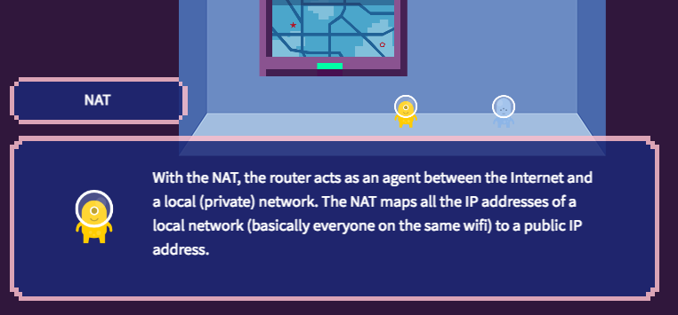
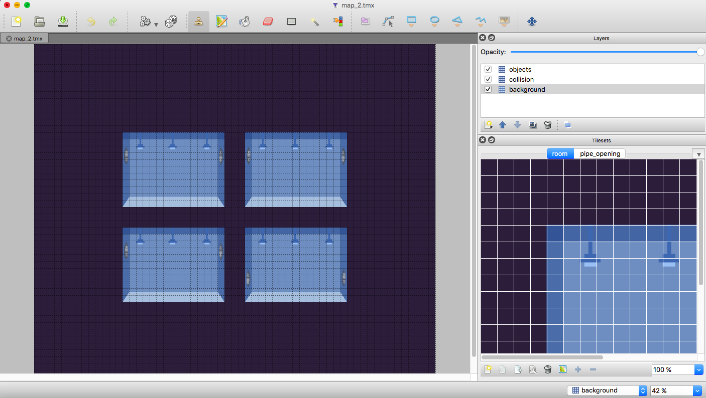
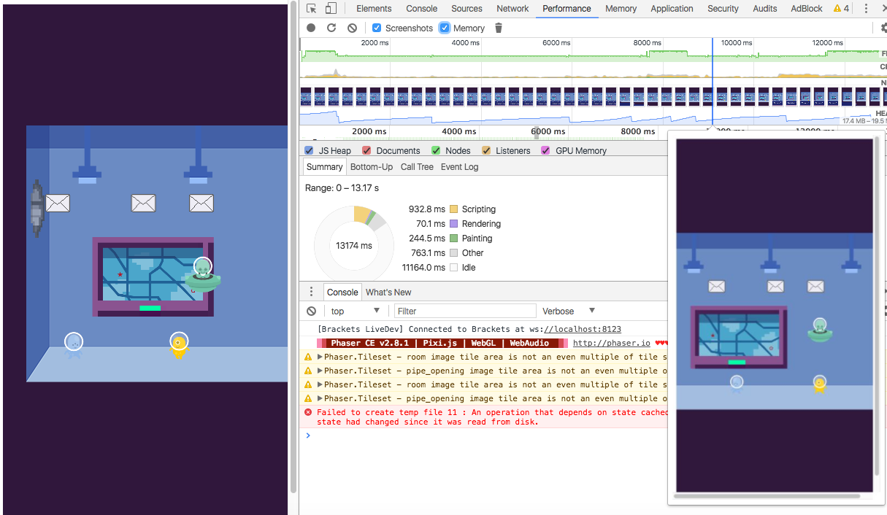
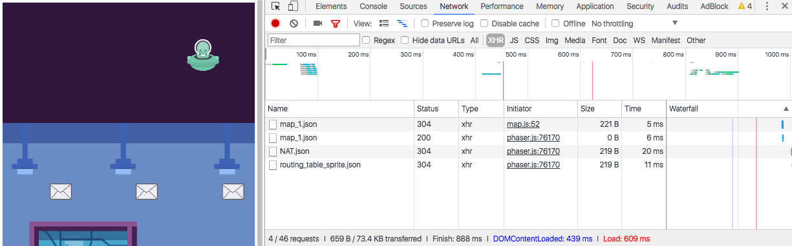
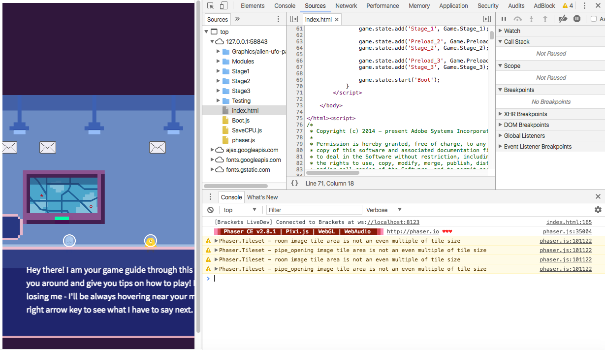
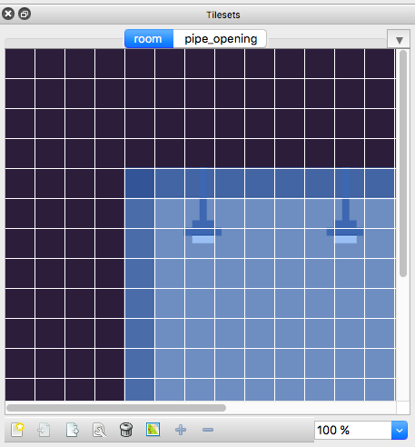
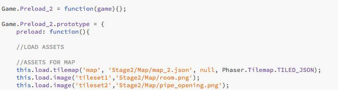
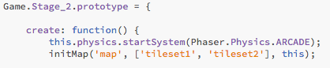

# CMU-Network-Game
A course that covers computer networking, network security, and network testing basics disguised as a game! The basic course structure is as follows:

| Topic                      | Learning Goals:                                                                       
|----------------------------|---------------------
| Parts of Network           | Learn about Routers, Clients, Servers, and Data Packets.                                                 
|Simple Network Structures   |Learn how data moves through simple network structures, such as a simple client - router - server network. 
| Complex Network Structures | Learn how data moves through more complex network topologies, specifically through a multi-root tree.      |
| Security for Networks      | Learn about ACLs, IPS, Proxies, and Stateful Firewalls.
| Networks with Basic Functions    | Learn how networks integrate basic security measures introduced earlier (ACLs).                                         |
| Networks with Advanced Functions    | Learn how networks integrate advanced security measures introduced earlier (IPS/IPS, Proxies, Stateful Firewalls)                                         |
| Policies                   | Learn about how stateless network policies work (basic ACL configurations).                               |
| Advanced Policies          | Learn how stateful network policies work (IPS configuration).                                              |
| Buzz Algorithm             | Learn about the [Buzz algorithm](https://users.ece.cmu.edu/~vsekar/papers/nsdi16_buzz.pdf) and why it is ground-breaking for verifying policies in a stateful network. |

> A stateless function is defined as a network function that does not retain information about the connection. Stateful functions, in comparison, actively track information about the connection, for example, tracking SYN, SYN-ACK, ACK packets in a TCP connection.


These concepts are presented in an easily absorbable, non-technical format. **Rooms** are used to abstract network functions and elements. Data flow in a network is represented graphically by a stream of flying mail envelopes. For example, here is a **Room** abstracting a stateful firewall:


The player placed right inside a computer network and is encouraged to roam around the world, click on the characters and elements, and learn about these different network parts interactively. Here is a sample interaction between a player and the NAT:




# How do I use this? 
## Running the Files
To run the files, you will need to host a web server on your computer. This is to allow the `HTTP` requests to fire properly.

### Python Web Server (For Quick Viewing):
Download Python if you haven't already. Go into the directory of the 'index.html' file and run the command `python -m SimpleHTTPServer 8000` in command line. Load the URL `http://localhost:8000/` into your browser.

### Node.JS Web Server (For Quick Viewing):
Install `http-server` via `npm`: `npm install http-server -g`. You can now run this server through the command line through the simple command `http-server`. Load the URL `http://localhost:8080` into your browser. See https://www.npmjs.com/package/http-server for more details.

### Brackets Text Editor (For Developers):
Download brackets at http://brackets.io/. Brackets editor has a built in local server that can host your code (Live Preview). 

## Editing TileMaps
The game world is defined by a `json` tile-map file, which is generated by [**Tiled Map Editor**](http://www.mapeditor.org/), a free to use tile-map editor. The default file type exported by **Tiled Map Editor** is `tmx`. Downloading this software is highly recommended.

> A tile-map is a map of a game world made up of individual tiles. Examples include old Nintendo games such as Mario or Sonic. The game world is built by distinct basic building blocks. This technique was developed in the early days of game programming to save memory when generating game worlds.



## Tips 
- Run the files on Chrome, which supports WebGL and advanced HTML5 Canvas features. Chrome is also well suited for the CPU intensive processes of rendering the game.
- Chrome includes Developer Tools, which developers can use to debug their code using the console, or check any errors thrown by their code. It is also extremely useful for tracking the performance of their game code.
- However, avoid changing the size of your window too often. It forces the game to recalculate and re-render the game world size and positions, which may slow down your computer.

#### Here are some neat things you can do with Developer Tools:
Tracking performance:
>

Tracking network request times:
> 

Looking at the console:
>


# Understanding Phaser
Before starting to develop, it's good to familiarize yourself with [Phaser](https://phaser.io/) first. Phaser is the core game engine that this game uses. Phaser is extremely well documented, with hundreds of code samples and official public [documentation](https://photonstorm.github.io/phaser-ce/). The basic Phaser event loop goes like this:

### Preload: 
This function is called first. It should contain code to handle the loading of assets needed by your game. While any code can be written here, it is suggested to keep it simply to loading assets. 
###### Function Syntax:
```javascript
create: function () {
...
},
```

###### Example Body Code:
```javascript
this.load.tilemap('map', 'Stage2/Map/map_2.json', null, Phaser.Tilemap.TILED_JSON);  
this.load.atlas('StatefulFW', 'Modules/Assets/StatefulFW.png', 'Modules/assets/StatefulFW.json', null, Phaser.Loader.TEXTURE_ATLAS_JSON_HASH);
this.load.image('ConnectionTable', 'Modules/Assets/small_screens.png'); 
```
The structure is as follows. The first parameter in `'` is the key (for example, `'ConnectionTable'`), which is mapped to a URL of the asset (for example, `'Modules/Assets/small_screens.png'`). The parameters after are usually extra parameters to processs more complicated types of assets, such as JSON hash arrays or tilemaps.

---

### Create: 
In this function, developers can safely create [sprites](http://phaser.io/docs/2.4.4/Phaser.Sprite.html), text objects, or anything else needed that may use assets the preload will now have loaded. Typically this function would contain the bulk of the set-up code, creating game objects and the like. 
###### Function Syntax:
```javascript
create: function () {
    ...
},
```
###### Example Body Code:
```javascript
this.physics.startSystem(Phaser.Physics.ARCADE); //starts the physics system
        addControls(this); //function that maps keyboard input to game events

        initMap('map', ['tileset1', 'tileset2'], this); //function to render map
        initDialogue(this); //function to set up dialogue sprites
```

Many of the basic things needed to set up your game world will have been pre-written in a `.js` file in the **Modules** folder.

---

### Update: 
The update functions are called every frame. So on a desktop that'd be around 60 time per second. In update this is where developers do things like listen or poll for input to move a player, check for object collision, etc. It's the heart of the game, and it is a continous loop that makes the game come alive. 
###### Function Syntax:
```javascript
update: function () {
    ...
},
```

###### Example Body Code:
```javascript
    updateDialoguePos(this); //updates the position of the dialogue box based on input
    pollCameraControls(this); //checks for keyboard input to move camera 
    ...
    addCollision(NAT, this); //checks for collision between a sprite called "NAT" and the game world (this)

    updatePacketPos(this.packetStream1, this); //updates the position of the packets in network traffic
```

## Phaser Physics
In this game, the physics engine used is called ```javascript [Phaser.Physics.ARCADE] ```. You can see it action [here](https://phaser.io/examples/v2/category/arcade-physics) or read more about it [here](https://photonstorm.github.io/phaser-ce/index.html#toc19).

This game uses two classes related in the Arcade Physics package: Arcade and Body.

| Class  | via            | Description                                                                                 |
|--------|----------------|---------------------------------------------------------------------------------------------|
| Arcade | `physics.arcade` | The Arcade Physics handler. Contains collision, overlap and movement related methods.       |
| Body   | `sprite.body`    | An Arcade Physics Body. Contains velocity, acceleration, drag and other related properties. |

In Phaser physics, `collision` between objects is a crucial function. If the developer wants a sprite (for example, the player) to be able to walk on top of the collision layer in the map (for example, the ground), the update function "collides" the boundaries of the sprite with the map 60 times a second approximately. This prevents the sprite from falling through the ground, or whatever else it is colliding with.

All physics enabled sprites have a `body`, which has internal variables that can be get or set by the developer. Such variables include the speed or velocity, acceleration, and position.


# What am I downloading?
### Core Files:
- `index.html`: Loads in all the scripts and initializes a `new Phaser.Game`. Adds all the `Preload.js` and `Stage.js` files to the game state. Adds a `Boot.js` file to the game state. Starts the `Boot.js` file.
- `Boot.js`: Boots up the game. Currently, not preloading bar is initialized, but this may change in future versions. `Boot.js` also starts up a developer defined `Preload.js` file.
- `SaveCPU.js`: An external Phaser plugin that decreases CPU usage when rendering frames.
- `phaser.js`: A copy of the most recent Phaser library.
- `README.md`: What you're reading right now!


### Folders:
The **Modules** folder contains many of the custom-written code that helps processes this game specifically. This includes the following files thus far:
- `loader.js`: Loads all the *Modules* files by manipulating the index.html dynamically.
- `camera.js`: Defines and adds functionality for moving the in-game [camera](https://photonstorm.github.io/phaser-ce/Phaser.Camera.html). 
- `dialogue.js`: Handles rendering the dialogue animations, content, and position.
- `guide.js`: Defines and adds functionality for moving the game guide sprite.
- `lessons.js`: Defines arrays storing the dialogue of different sprites.
- `map.js`: Reads in the JSON files containing map data, and initializes it into the game world.
    - Contains a very specific framework for loading the map. Look at the **How can I start developing?** section for more details.
- `packet.js`: Renders an animation of a packet stream by calculating positions and velocities.
- `sprite.js`: Defines a basic framework for adding in-game sprites. Includes more functions defining different types of sprite movement.
- `stages.js`: Includes stages representing network functions. Functions are used to populate an area with sprites in a pre-determined way.
- *Assets*: Includes global assets used in various module files. This includes `PNG` graphics and `JSON-TP-HASH` spritesheets for character graphics. A big thanks to **Maggie Yuan** for contributing to the graphics!

The **Graphics** folder contains external graphics that are used in this game. A big thanks to the [Kenney Group](http://kenney.nl/) for contributing to the graphics!

The **Stage** folders represent each individual stage. Each stage represents a certain lesson or module in the course. For example, the folder **Stage1** corresponds to the first module **Parts of Network**. These folders are numbered numerically. These contain the individual lessons that are designed to teach specific networking concepts. Every folder contains the following basic elements:
- *Map Folder*: Contains assets used in the stage. Will include `.png` graphics `.tmx` / `.json` map files.
- `Preload.js`: Preloads all the game assets into the game state.
- `Stage.js`: Creates all the game objects and runs the game event loop.


The **Testing** folder contains scripts used primarily to test new modules in the *Modules* folder before deploying it to the *Stage* folders.

# How can I start developing?
### Documentation:
Take a good look at the documentation for for the files in **Modules**. It handles all the heavy lifting developers need to program their game, from reading in map files and initializing the game world to even predefined rooms for common computer network components, including the *router, ACL, Stateful Firewalls, IPS/IPS,* and *proxies*.

### Making New Stages:
When making new lessons/stages, put all of the files in a organized manner into a singular folder, named StageN, with N being the next highest integer  number available.  For example, if the latest stage addition is numbered "5", number the new stage folder "6". The folder contents should be organized in the same way as the other **Stage** folders, with a **Map** folder containing game assets, a **Preload.js** file with the `preload` function, and a **StageN.js** (N being an integer) for the `create` and `update` functions. For further details, look over the existing folders for examples.

### Making New Maps:
Using Tiled editor, you should always have three distinct layers. They can be named any way you want, but for organization purposes, please default to *Background, Collision,* and *Object*.


Your tileset images should be imported, and named appropriately as well.



Export your maps as a `.tmx` and a `.json` file, and put it into the **Map** folder in your **Stage** folder. In your `Preload.js` file, import the images you used for your tilemap. The `URL` of your game image should be mapped to a unique key. For example, in the following image, `Stage2/Map/room.png` is mapped to the key 'tileset1'.



In your `Stage.js` file, initialize the map using `initMap` function. The first parameter is the key of the `JSON` map file exported from Tiled Map Editor. The second parameter is an array containing the keys for the tilesets used in your map (in order of your layers). The final parameter `this` holds a copy of the game variable instance.




### Included Starter Kit:
Additionally, if you are still lost, there is a folder named **Shell Stage** that has a the basic framework, organizational structure, and `js` files set up for you already. Simply replace the `X` in the file names as well as in the code with the appropriate integer value.

# FAQ 
> When I try to run the files, I see this error in my console:
```
XMLHttpRequest cannot load file...Cross origin requests are only supported for protocol schemes: http, data, chrome, chrome-extension, https.
```
Why can't it load the files?

Look at the **Usage** section. You need to host a http-server to run the files. 

> Why do you create a `Game` object in `Boot.js`?

This is to help modularize the code. The `Game` object has properties, which are the individual preload and stage files. For example:
```javascript
    Game.Stage_2 = function(game){...};
```
The function `Stage_2` here is attached as a property of `Game`. The prototype is then modified:
```javascript
Game.Stage_2.prototype = {
        
    create: function() {
        ...
    },
    
    update: function(){ 
        ...
    }, 
}
```
The properties of the object `Game` are then added to the game state as such:
```javascript
    ...
    game.state.add('Stage_2', Game.Stage_2);
    ...
```
You can then start the function `Game.Stage_2` through the key `'Stage_2'`:
```javascript
   this.state.start('Stage_2'); 
```
Note that starting a stage function is usually placed in the `Preload.js` file, as you need preload the  necessary assets before creating the stage.


>Why does the code use the keyword `this`? In the Phaser docs, functions are written as using game. For example: 
>```javascript 
>game.physics.startSystem(Phaser.Physics.ARCADE)
>``` 
>But in your files, `game` is accessed as 
>```javascript
>this.physics.startSystem(Phaser.Physics.ARCADE)
>```
>using keyword `this`. Why is that?

Well, note that `game` is passed in at the top of every new property to `Game`. For example:
```javascript
Game.Stage_2 = function(game).
```
The `create` and `update` functions are part of the prototype of the function. Thus, in the `create` and `update`, `game` is accessed as `this`. As an extra note, in the module functions, `game` is supposed to be passed into the parameter `gameInstance`.


